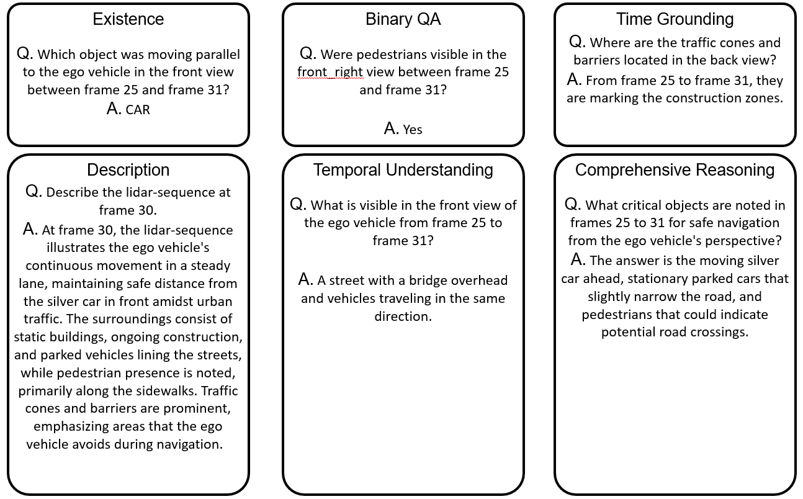

# B4DL
Official PyTorch implementation of the paper "B4DL: A Benchmark for 4D LiDAR LLM in Spatio-Temporal
Understanding".

[](https://huggingface.co/datasets/ccho4702/nuScenes-B4DL)
[](https://www.arxiv.org/abs/2508.05269)
[](https://arxiv.org/pdf/2508.05269)


---
## Data Generation Pipeline
**You should make your own OpenAI API key before running the code.**
```bash
cd datageneration
```

## 4D LiDAR Context Extraction Step
Please download the `nuScenes` dataset and set the `nuscenes_root` argument to the download path.

Run the following commands:
```bash
bash scripts/generate_description.sh
```
or you can run the python code directly
```bash
python3 generate_description.py \
    --start_index 10 \
    --end_index 20 \
    --api_key {your openai api key} \
    --nuscenes_root /mnt/nfs_shared_data/dataset/cch/nuScenes \
    --dataroot ./data
```

## Context-to-QA Transformation Step
```bash
bash scripts/generate_dataset.sh
```

or you can run the python code directly
```bash
python3 generate_dataset.py \
    --start_index 0 \
    --end_index 10 \
    --api_key {your openai api key} \
    --nuscenes_root /mnt/nfs_shared_data/dataset/cch/nuScenes \
    --dataroot ./data \
    --task existence
```

---
## Training Script

Before running, please download [this file](https://huggingface.co/lmsys/vicuna-7b-v1.5/tree/main) and place it under ./base_model/

```shell
bash run_stages.sh \
     --s1_data ./b4dl_dataset/stage1_lidarllm_mm.json \
     --s1_feat ./b4dl/stage1_features \
     --s2_data ./b4dl_dataset/stage2.json \
     --s2_feat ./b4dl/stage2_features \
     --model_name_or_path ./base_model/vicuna-v1-5-7b
```

For training, check out here(mllm/README.md).

---

## Demo

<table align="center">
  <tr>
    <td colspan="2" align="center"><b>Example of Generated Dataset</b></td>
  </tr>
  <tr>
    <td align="center">
      
    </td>
    <td align="center">
      
    </td>
  </tr>
  
  <tr>
    <td colspan="2" align="center">
      
    </td>
  </tr>
  
  <tr>
    <td colspan="2" align="center"><b>Example of Inference</b></td>
  </tr>
  <tr>
    <td align="center">
      
    </td>
    <td align="center">
      
    </td>
  </tr>
  <tr>
    <td colspan="2" align="center">
      
    </td>
  </tr>
</table>

---

## Acknowledgements
This work was partly supported by the Institute of Information &
Communications Technology Planning & Evaluation(IITP) grant
funded by the Korea government(MSIT) (No.RS-2024-00439020,
Developing Sustainable, Real-Time Generative AI for Multimodal
Interaction, SW Starlab) and partly supported by the Institute of
Information & Communications Technology Planning & Evaluation(IITP) grant funded by the Korea government(MSIT) (No.RS2025-02283048, Developing the Next-Generation General AI with
Reliability, Ethics, and Adaptability)

If you're using VTimeLLM in your research or applications, please cite using this BibTeX:
```bibtex
@inproceedings{Choi_2025, series={MM ’25},
   title={B4DL: A Benchmark for 4D LiDAR LLM in Spatio-Temporal Understanding},
   url={http://dx.doi.org/10.1145/3746027.3755074},
   DOI={10.1145/3746027.3755074},
   booktitle={Proceedings of the 33rd ACM International Conference on Multimedia},
   publisher={ACM},
   author={Choi, Changho and Shin, Youngwoo and Han, Gyojin and Lee, Dong-Jae and Kim, Junmo},
   year={2025},
   month=oct, pages={3399–3407},
   collection={MM ’25} }
```

## License
<a rel="license" href="https://creativecommons.org/licenses/by-nc-nd/4.0/"></a> 

This work is licensed under a <a rel="license" href="http://creativecommons.org/licenses/by-nc-nd/4.0/">Creative Commons Attribution-NonCommercial-NoDerivs 4.0 International License</a>.
